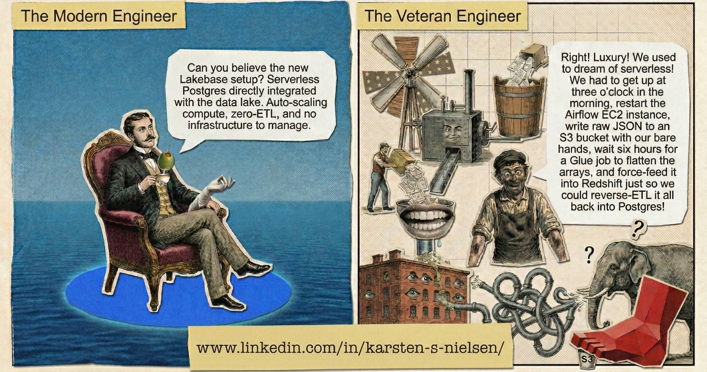

# (Right! Luxury!) Lakehouse

> *"Luxury! We used to dream of serverless! We had to get up at three o'clock in the morning, restart the Airflow EC2 instance, write raw JSON to an S3 bucket with our bare hands, wait six hours for a Glue job to flatten the arrays, and force-feed it into Redshift just so we could reverse-ETL it all back into Postgres!"*



<sup>Comic by NanoBanana &mdash; inspired by Monty Python's *Four Yorkshiremen*</sup>

---

[](https://github.com/karsten-s-nielsen/luxury-lakehouse/actions/workflows/python-ci.yml) [](https://huggingface.co/spaces/luxury-lakehouse/soccer-analytics-demo) [](https://huggingface.co/luxury-lakehouse) [](https://huggingface.co/luxury-lakehouse/football2vec-v2) [](https://huggingface.co/luxury-lakehouse/xg-model-statsbomb-wyscout)

## What Is This?

A serverless soccer analytics platform built on **Databricks Lakebase** — replacing a 6-service traditional AWS pipeline with a unified lakehouse architecture that scales to zero.

The platform ingests open-source match data from professional football, transforms it through a medallion architecture, and serves interactive dashboards for coaches, scouts, and analysts.

### The Old Way (The Veteran Engineer)

```
Data Providers → EC2 Airflow → S3 Raw → AWS Glue → S3 Processed → Redshift → dbt → Reverse ETL → S3 → RDS PostgreSQL → Taipy
```

Six AWS services. Five data movement hops. Always-on compute. Manual credential management. The full Victorian workhouse experience.

### The New Way (The Modern Engineer)

```
Data Providers → Databricks Workflows → Delta Lake (Bronze/Silver/Gold) → Synced Tables → Lakebase PostgreSQL 17 → Taipy
```

Two services. Zero-ETL. Scale-to-zero. Automatic OAuth. Right luxury.

## Architecture

> **[View interactive C4 diagrams](docs/c4/architecture.html)** &mdash; System Context, Pipeline Containers, Taipy Containers, Filter Cascade, and Deployment levels, generated from [Structurizr DSL](docs/c4/architecture.dsl)

| Layer | Technology | Purpose |
|-------|-----------|---------|
| **Ingestion** | Databricks Serverless Workflows | Fetch data from StatsBomb, Metrica, Wyscout, IDSSE, SkillCorner |
| **Storage** | Delta Lake on Unity Catalog | Medallion architecture (Bronze → Silver → Gold) |
| **Transformation** | dbt-databricks on Serverless SQL | Flatten nested JSON, compute xG/xT metrics |
| **Synchronization** | Lakeflow Synced Tables | Zero-ETL continuous sync from Gold → Lakebase |
| **Serving** | Lakebase PostgreSQL 17 (Autoscaling) | Sub-10ms OLTP queries, native pgvector, scale-to-zero |
| **Application** | [Taipy on Hugging Face Spaces](https://huggingface.co/spaces/luxury-lakehouse/soccer-analytics-app) | 14-page interactive dashboard (Docker SDK, Lakebase PostgreSQL) |
| **ML Artifacts** | [Hugging Face Hub](https://huggingface.co/luxury-lakehouse) | Publish [7 models](https://huggingface.co/luxury-lakehouse) + [17 datasets](https://huggingface.co/luxury-lakehouse), GPU training on HF Jobs, and [interactive demo](https://huggingface.co/spaces/luxury-lakehouse/soccer-analytics-demo) |
| **Security** | OAuth M2M + OIDC Federation + KMS | Zero-secret CI, least-privilege SPs, encrypted state |
| **Infrastructure** | Terraform + Databricks Provider | Everything as code |

## Data Sources

| Provider | Data Type | Format | License | Coverage |
|----------|-----------|--------|---------|----------|
| [StatsBomb Open Data](https://github.com/statsbomb/open-data) | Match events + 360 context | Nested JSON | CC-BY 4.0 | ~3,000 matches |
| [Metrica Sports](https://github.com/metrica-sports/sample-data) | Optical tracking (25 fps) | CSV/EPTS (Electronic Performance and Tracking Systems) | Unlicensed | 3 sample matches |
| [Wyscout](https://figshare.com/collections/Soccer_match_event_dataset/4415000) | Event streams | JSON | CC-BY-NC 4.0 | Top 5 leagues |
| [IDSSE (Bundesliga)](https://figshare.com/collections/DFL_-_Bundesliga_Data_Shootout/5830772) | DFL tracking (25 fps) + events | XML | CC-BY 4.0 | 7 matches |
| [SkillCorner](https://github.com/SkillCorner/opendata) | Broadcast tracking (10 fps) | JSONL | MIT | 10 A-League matches |
| *Respo.Vision* (planned) | 3D pose tracking | JSON | Own footage | Own recordings |

## Analytics

Built on the [Soccermatics](https://soccermatics.readthedocs.io/) curriculum by David Sumpter:

- **Expected Goals (xG)** — Custom calibrated XGBoost (13 features, ROC-AUC 0.979) + logistic baseline, trained on ~131K shots, [published to Hugging Face](https://huggingface.co/luxury-lakehouse/xg-model-statsbomb-wyscout)
- **Expected Threat (xT)** — Data-driven pitch zone valuation via Markov chains (computed from 2.2M SPADL (Simplified Player Action Description Language) actions)
- **Pass Networks** — Interactive team passing structure with hover tooltips (Plotly)
- **Heat Maps** — Action density visualization for players and teams
- **VAEP (Valuing Actions by Estimating Probabilities) Action Valuation** — Player contribution scoring beyond goals/assists (SPADL + VAEP)
- **Pitch Control** — Physics-based (Spearman 2017) and Voronoi models from tracking data
- **Line-Breaking Passes** — Ward clustering + cross-product straddle test for defensive line penetration (StatsBomb 360)
- **Movement & Pressing** — PPDA (Passes Per Defensive Action) pressing intensity, physical performance metrics (distance, HSR (High-Speed Running), sprints), and off-ball xT from tracking data
- **Defensive Impact (DEFCON-lite)** — Attacker-perspective defensive credit assignment (intercept/concede/disturb/deter) based on Kim et al. (2025)
- **Cross-Source Entity Resolution** — Three-layer progressive player matching (TF-IDF + rapidfuzz + bidirectional validation) inspired by US Soccer's glass_onion
- **Player Embeddings** — Dual-vector player representation: 128-dim transformer behavioral (adversarial team-debiased, Ganin GRL) + 13-dim statistical z-score, published to Hugging Face Hub. V1 (32-dim Doc2Vec) retained as baseline.
- **Player Similarity** — pgvector HNSW cosine-distance search ("Find players like X") with interactive dashboard page
- **PAUSA (Passing Ability Under Spatiotemporal Awareness) Pass Timing** — Optimal pass timing decomposition: temporal judgment vs spatial selection, OBSO (Off-Ball Scoring Opportunities) value surfaces (Lee et al. 2026)
- **Player Comparison** — Per-90 stat comparison across multiple metrics (incl. DEFCON pressure/90)
- **Team Shape** — Convex hull, centroid, formation lines, 6 spatial metrics (stretch index, team length/width, defensive line height, inter-line gaps) from tracking data
- **Formation Detection** — Dual-detector: EFPI template matching (Bekkers & Dabadghao 2025) + shape graph geometric detection (Sotudeh 2026, Delaunay triangulation)
- **Position Maps** — 5x5 time-in-position matrices per player per match (all/in-possession/out-of-possession phases) from shape graph position assignments

## Project Structure

```
luxury-lakehouse/
├── terraform/          # Infrastructure as Code (Databricks on AWS)
├── src/
│   ├── analytics/      # Pure-Python analytics models (pitch control, line-breaking, entity resolution, DEFCON, football2vec, football2vec transformer, shape graphs, xG, xT, symmetry, smoothing)
│   ├── ingestion/      # Data ingestion + compute pipelines (StatsBomb, Metrica, Wyscout, IDSSE, SkillCorner, pitch control batch)
│   ├── shared/         # Cross-package constants and identifier validation (zero external deps)
│   └── workflows/      # Workflow framework (@workflow decorator, registry, lifecycle hooks, YAML card parser)
├── hf_taipy_app/       # Taipy production dashboard (deployed to HF Spaces)
├── notebooks/          # Databricks notebooks (football2vec/xG training, model weight sync, dataset publishing to HF Hub)
├── demo_space/         # Hugging Face Gradio demo Space (pass quality, pitch control, player similarity, shot map, DEFCON pressure, pass timing)
├── dbt_project/        # Bronze → Silver → Gold transformations
├── workflow-cards/     # YAML workflow card manifests (32 AI/ML workflow definitions)
├── scripts/            # Operational scripts (PG indexes, grants, synced table management)
├── docs/
│   ├── c4/             # C4 architecture diagrams (Structurizr DSL)
│   ├── huggingface/          # HF Hub model cards (football2vec, xG), org card, dataset cards (source of truth)
│   └── huggingface-setup.md  # Hugging Face Hub integration guide
├── assets/             # Images and branding
├── ARCHITECTURE.md     # Platform architecture and design decisions
└── ROADMAP.md          # Research directions and future ideas
```

## Spark vs Python: Scale vs Simplicity

All compute pipelines use `applyInPandas` to distribute work across Spark executors — the driver never touches raw data. This matters at enterprise scale (millions of rows per match, hundreds of matches) where driver-bound Python loops hit OOM walls.

For community/personal use on Databricks Community Edition or smaller datasets, the pure-Python analytics modules (`src/analytics/`) work standalone without Spark. The tradeoff:

| | PySpark (`applyInPandas`) | Pure Python (pandas) |
|---|---|---|
| **Scale** | Hundreds of matches, 38M+ tracking rows | Single matches, <5M rows |
| **Setup** | Databricks Serverless or cluster | `pip install` + local notebook |
| **Driver memory** | 16 GB fixed (serverless) | Your machine's RAM |
| **Effort** | Higher (Spark schemas, UDF closures) | Lower (direct function calls) |

The `src/analytics/` modules (pitch control, line-breaking, DEFCON, off-ball xT, entity resolution) are pure Python/NumPy/pandas — no Spark dependency. The `src/ingestion/` modules handle Spark orchestration around them. This separation means the analytics are usable outside Databricks.

## Status

**Cycle 3 complete (PSxG + Football2Vec 360)** — 14 Taipy pages, 28 synced tables (Lakebase reverse-ETL), 56 PG indexes (sub-second dashboard queries), 1,051 unit tests (1,063+ with gensim). Hugging Face Hub: 7 models + 17 datasets published, GPU training on HF Jobs A10G, [Gradio demo Space](https://huggingface.co/spaces/luxury-lakehouse/soccer-analytics-demo) with luxury flagship theme (6 tabs). Football2vec v2: 128-dim transformer embeddings with adversarial team debiasing (Ganin GRL). Shape graph formation detection (Sotudeh 2026) + 5x5 position maps. xG v2 set encoder (ROC-AUC 0.915, MC dropout uncertainty). PSxG logistic model (Butcher et al. 2025) + Football2Vec 360 encoder (144-dim). See [ARCHITECTURE.md](ARCHITECTURE.md) for the platform architecture and [ROADMAP.md](ROADMAP.md) for research directions.

| Phase | Description | Status |
|-------|-------------|--------|
| 0 | Foundation & Prerequisites | Complete |
| 1 | Serverless Infrastructure (Terraform) | Complete |
| 2 | Data Ingestion (StatsBomb, Metrica, Wyscout) | Complete |
| 3 | Transformation (dbt on Databricks) | Complete |
| 4 | Zero-ETL Synchronization (Synced Tables → Lakebase) | Complete |
| 5 | Application Deployment (Streamlit → Taipy) | Complete |
| 5.5 | Lakebase Autoscaling + PG 17 Migration | Complete |
| 5.6 | IAM OIDC + OAuth M2M + KMS Hardening | Complete |
| 6 | StatsBomb 360 Freeze Frames | Complete |
| 7 | Metrica Game 3 (EPTS) + Pitch Control | Complete |
| 8 | Heat Map + Pass Network Pages | Complete |
| 9 | SPADL/VAEP Action Valuation | Complete |
| 10 | Additional Tracking Data (IDSSE, SkillCorner) | Complete |
| 11 | Physics-Based Pitch Control (Spearman 2017) | Complete |
| 12 | Movement Analysis | Complete |
| 13 | Line-Breaking Pass Detection | Complete |
| 14 | Cross-Source Player Entity Resolution | Complete |
| 15 | Player Embeddings (Doc2Vec + z-score) | Complete |
| 16 | Player Similarity Page (pgvector HNSW) | Complete |
| 17 | DEFCON-lite Defensive Pressure | Complete |
| 18 | Hugging Face Hub Expansion | Complete |
| 19 | Model Ops & Event Sync (ELASTIC, PAUSA, drift detection) | Complete |
| 20 | Taipy Migration (14 pages, full content parity) | Complete |

## Getting Started

See the [Getting Started guide](docs/getting-started.md) for local setup (clone, install, verify), or try the [live demo](https://huggingface.co/spaces/luxury-lakehouse/soccer-analytics-app) immediately. For pre-trained model usage, see the [Hugging Face setup guide](docs/huggingface-setup.md). For domain terminology, see the [Glossary](docs/glossary.md).

## Tech Stack

| Category | Tool |
|----------|------|
| Cloud | AWS (us-east-1) + Databricks Premium |
| IaC | Terraform with `databricks/databricks` provider |
| Data Lake | Delta Lake on Unity Catalog |
| OLTP Database | Databricks Lakebase (PostgreSQL 17, autoscaling) |
| Transformations | dbt-core + dbt-databricks |
| Orchestration | Databricks Serverless Workflows |
| Application | Taipy 4.1 + mplsoccer + Plotly |
| Vector Search | pgvector HNSW (native in Lakebase) |
| Embeddings | gensim (Doc2Vec) + huggingface_hub (model publishing) |
| Python | 3.10+ (Databricks serverless), managed with uv |
| Linting | ruff + pyright + sqlfluff + import-linter |
| CI/CD | GitHub Actions |
| Architecture Docs | C4 diagrams (Structurizr DSL) |

## Engineering Process

[Claude Code](https://docs.anthropic.com/en/docs/claude-code) skills enforce architectural quality through structured engineering practices at every development cycle.

### [mad-scientist-skills](https://github.com/karsten-s-nielsen/mad-scientist-skills)

Quality gates invoked at key project milestones — architecture visualization, security hardening, and (in beta) observability and optimization reviews. These skills align directly with the engineering standards codified in [CLAUDE.md](CLAUDE.md).

| Skill | Purpose | Invoke |
|-------|---------|--------|
| **c4** | Generate interactive C4 architecture diagrams from Structurizr DSL | `/mad-scientist-skills:c4` |
| **final-review** | Pre-commit quality gate — code review, documentation check, C4 diagram refresh | `/mad-scientist-skills:final-review` |
| **security-audit** | STRIDE threat modeling, OWASP Top 10, infrastructure hardening (Standard/Enterprise tiers) | `/mad-scientist-skills:security-audit` |
| **optimization-audit** | Algorithm efficiency, query performance, caching, concurrency, cloud cost (beta) | `/mad-scientist-skills:optimization-audit` |
| **observability-audit** | Instrumentation, logging, metrics, tracing, alerting, SLIs/SLOs (beta) | `/mad-scientist-skills:observability-audit` |

### [superpowers](https://github.com/obra/superpowers)

Development methodology framework by [Jesse Vincent](https://github.com/obra) that provides the underlying workflow discipline — brainstorming before building, planning before coding, TDD before implementing, verification before claiming done. Superpowers runs automatically in every session and dispatches the appropriate methodology skill based on context.

## Giving Back

> *"En Del Af Noget Større"* (A Part of Something Bigger)

This project is, and always will be, free and open source. If you find value in this work, I encourage you to consider a donation to **Scottish Football for Rwanda** rather than any personal gift. I am volunteering as a goalkeeper coach in Rwanda in June 2026 — 100% of donations go directly to local kids, coaches, and community organizations.

[](https://www.justgiving.com/page/gk-coach-karsten-for-rwanda)

## License

[Apache License 2.0](LICENSE) &mdash; see [NOTICE](NOTICE) for third-party data attribution.

---

<sub>Named after Monty Python's *Four Yorkshiremen* sketch, where each comedian one-ups the others about how deprived their childhood was. In data engineering, moving from hand-managed EC2 instances and 5-hop Reverse ETL pipelines to serverless Lakebase truly is... right luxury.</sub>
