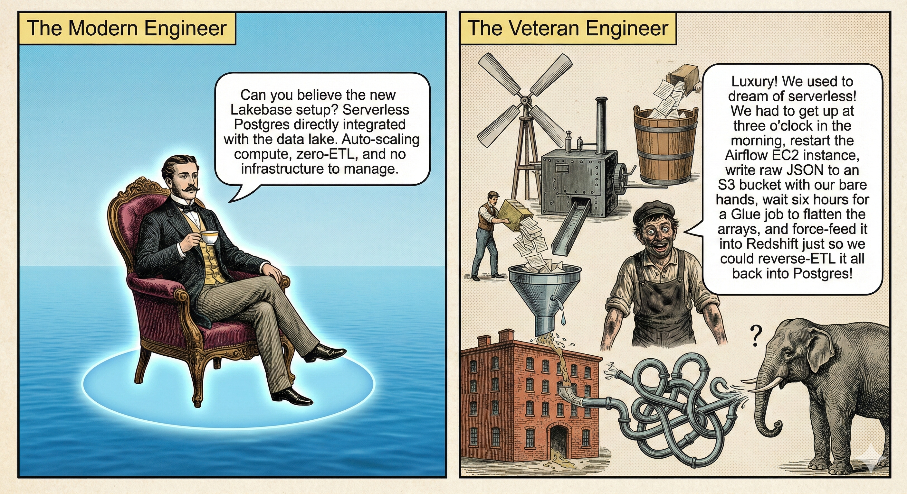

# Luxury Lakehouse

> *"Luxury! We used to dream of serverless! We had to get up at three o'clock in the morning, restart the Airflow EC2 instance, write raw JSON to an S3 bucket with our bare hands, wait six hours for a Glue job to flatten the arrays, and force-feed it into Redshift just so we could reverse-ETL it all back into Postgres!"*



<sup>Comic by NanoBanana &mdash; inspired by Monty Python's *Four Yorkshiremen*</sup>

---

## What Is This?

A serverless soccer analytics platform built on **Databricks Lakebase** — replacing a 6-service traditional AWS pipeline with a unified lakehouse architecture that scales to zero.

The platform ingests open-source match data from professional football, transforms it through a medallion architecture, and serves interactive dashboards for coaches, scouts, and analysts.

### The Old Way (The Veteran Engineer)

```
Data Providers → EC2 Airflow → S3 Raw → AWS Glue → S3 Processed → Redshift → dbt → Reverse ETL → S3 → RDS PostgreSQL → Streamlit
```

Six AWS services. Five data movement hops. Always-on compute. Manual credential management. The full Victorian workhouse experience.

### The New Way (The Modern Engineer)

```
Data Providers → Databricks Workflows → Delta Lake (Bronze/Silver/Gold) → Synced Tables → Lakebase PostgreSQL 17 → Streamlit
```

Two services. Zero-ETL. Scale-to-zero. Automatic OAuth. Right luxury.

## Architecture

> **[View interactive C4 diagrams](docs/c4/architecture.html)** &mdash; System Context and Container levels, generated from [Structurizr DSL](docs/c4/architecture.dsl)

| Layer | Technology | Purpose |
|-------|-----------|---------|
| **Ingestion** | Databricks Serverless Workflows | Fetch data from StatsBomb, Metrica Sports, Wyscout |
| **Storage** | Delta Lake on Unity Catalog | Medallion architecture (Bronze → Silver → Gold) |
| **Transformation** | dbt-databricks on Serverless SQL | Flatten nested JSON, compute xG/xT metrics |
| **Synchronization** | Lakeflow Synced Tables | Zero-ETL continuous sync from Gold → Lakebase |
| **Serving** | Lakebase PostgreSQL 17 (Autoscaling) | Sub-10ms OLTP queries, native pgvector |
| **Application** | Streamlit on Databricks Apps | Interactive dashboards with mplsoccer visualizations |
| **Infrastructure** | Terraform + Databricks Provider | Everything as code |

## Data Sources

| Provider | Data Type | Format | Coverage |
|----------|-----------|--------|----------|
| [StatsBomb Open Data](https://github.com/statsbomb/open-data) | Match events + 360 context | Nested JSON | ~3,000 matches |
| [Metrica Sports](https://github.com/metrica-sports/sample-data) | Optical tracking (25 fps) | CSV | Sample matches |
| [Wyscout](https://figshare.com/collections/Soccer_match_event_dataset/4415000) | Event streams | JSON | Top 5 European leagues |

## Analytics

Built on the [Soccermatics](https://soccermatics.readthedocs.io/) curriculum by David Sumpter:

- **Expected Goals (xG)** — Shot quality model using distance, angle, body part
- **Expected Threat (xT)** — Pitch zone valuation via Markov chains
- **Pass Networks** — Team passing structure and progressive passes
- **Pitch Control** — Voronoi diagrams from tracking data
- **Player Similarity** — pgvector cosine-distance search ("Find players like X")
- **Player Radar Charts** — Per-90 stat comparison across multiple metrics

## Project Structure

```
luxury-lakehouse/
├── terraform/          # Infrastructure as Code (Databricks on AWS)
├── src/
│   ├── ingestion/      # Data ingestion from StatsBomb, Metrica, Wyscout
│   └── streamlit_app/  # Interactive analytics dashboard
├── dbt_project/        # Bronze → Silver → Gold transformations
├── docs/
│   └── c4/             # C4 architecture diagrams (Structurizr DSL)
├── documents/          # Reference PDFs and architecture diagrams
└── PLAN.md             # Detailed implementation plan
```

## Status

**Phase 1: Infrastructure Deployed** — 8 Databricks resources provisioned via `terraform apply`. See [PLAN.md](PLAN.md) for the full implementation plan.

| Phase | Description | Status |
|-------|-------------|--------|
| 0 | Foundation & Prerequisites | Complete |
| 1 | Serverless Infrastructure (Terraform) | Complete |
| 2 | Data Ingestion (StatsBomb, Metrica, Wyscout) | Scaffolded |
| 3 | Transformation (dbt on Databricks) | Scaffolded |
| 4 | Zero-ETL Synchronization (Synced Tables → Lakebase) | Scaffolded |
| 5 | Application Deployment (Streamlit) | Scaffolded |

## Tech Stack

| Category | Tool |
|----------|------|
| Cloud | AWS (us-east-1) + Databricks Premium |
| IaC | Terraform with `databricks/databricks` provider |
| Data Lake | Delta Lake on Unity Catalog |
| OLTP Database | Databricks Lakebase (PostgreSQL 17, serverless) |
| Transformations | dbt-core + dbt-databricks |
| Orchestration | Databricks Serverless Workflows |
| Application | Streamlit + mplsoccer |
| Vector Search | pgvector (native in Lakebase) |
| Python | 3.12, managed with uv |
| Linting | ruff + sqlfluff |
| CI/CD | GitHub Actions |
| Architecture Docs | C4 diagrams (Structurizr DSL) |

## License

[MIT](LICENSE)

---

<sub>Named after Monty Python's *Four Yorkshiremen* sketch, where each comedian one-ups the others about how deprived their childhood was. In data engineering, moving from hand-managed EC2 instances and 5-hop Reverse ETL pipelines to serverless Lakebase truly is... right luxury.</sub>
